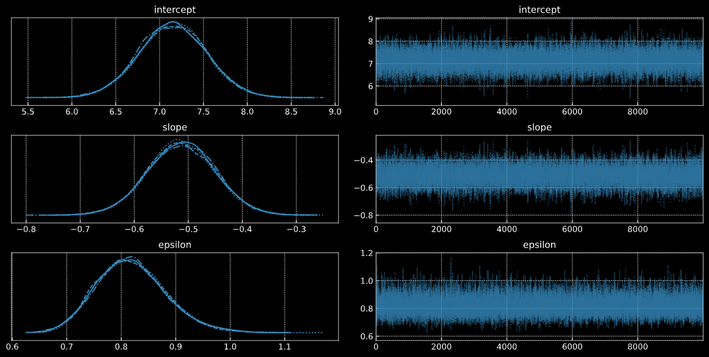


# Bayesian Statistics Specialization in Python 

This repository is a Python implementation of the different algorithms and problems proposed in the the courses [Bayesian Statistics: From Concept to Data Analysis](https://www.coursera.org/learn/bayesian-statistics), [Bayesian Statistics: Techniques and Models](https://www.coursera.org/learn/mcmc-bayesian-statistics) and [Bayesian Statistics: Mixture Models](https://www.coursera.org/learn/mixture-models) offered by the University of California Santa Cruz in Coursera.

The main idea is to provide a Python-based implementation in order to enable people who is not familiarized with R to play and learn Bayesian Statistics.

<div  align="center">

</div>

**Note**: Quizes and projects are not shared in this repository, only examples given within the lectures. All the text, equations and explanations were directly taken from the course.

## Table of content

The following table of content shows the different algorithms implemented in this repository.

 - [**Course 1, Bayesian Statistics: From Concept to Data Analysis**](https://github.com/MikeS96/bayes_statististics/tree/main/C1)  
	- **L4:** Plotting the Bernoully likelihood.
	- **L5:** Probability distributions in Python.
	- **L7:** Students problem with Bernoully and Binomial PMF.
	- **L12:** Frequentist Linear regression.
 - [**Course 2, Bayesian Statistics: Techniques and Models**](https://github.com/MikeS96/bayes_statististics/tree/main/C2)
	- **L3A:** Markov Chains.
	- **L3B:** Monte Carlo.
	- **L4A:** Metropolis Hastings.
	- **L4B:** Personnel example using PyMC3.
	- **L5:** Gibbs sampler.
	- **L6:** Methods to assess convergence.
	- **L7:** Bayesian Linear Regression.
	- **L9:** Bayesian Logistic Regression.
	- **L10:** Poisson Regression.
	- **L11A:** Hierarchical modelling.
	- **L11B:** Hierarchical modelling - Linear Regression.
	- **L11H:** Mixture models.
 - **Course 3, Bayesian Statistics: Mixture Models**
	- Coming soon :)

## Installation

To start using this repository,  run the following command and install the needed dependencies.
```
pip install -r requirements.txt
```
Open [jupyter notebook](https://jupyter.org/) in your favorite IDE and enjoy!
